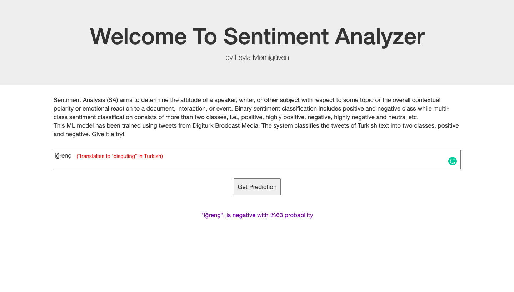
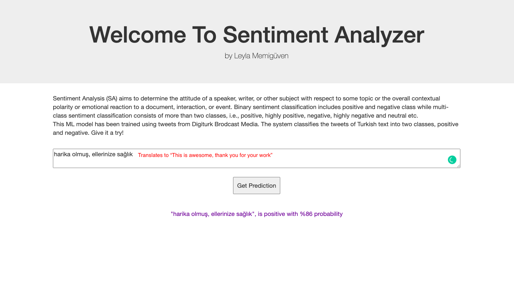
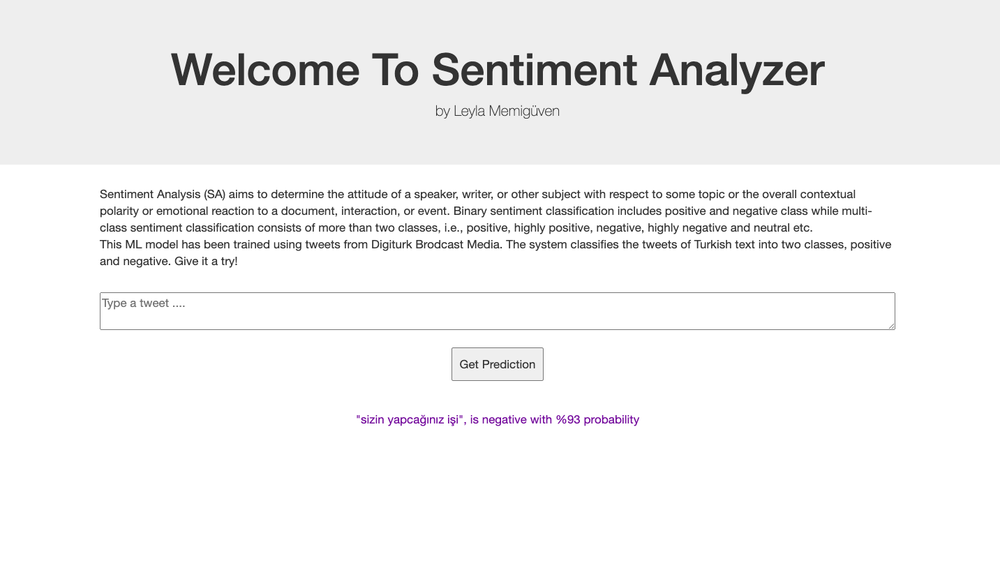
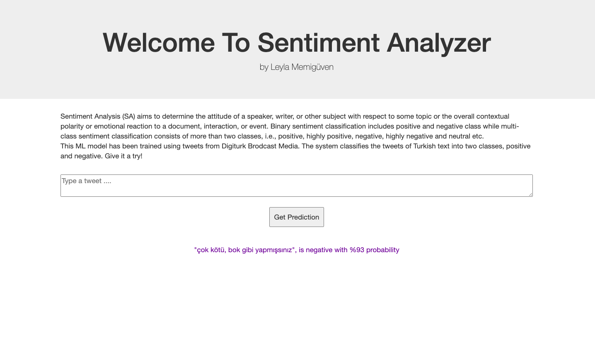

# digiturk-sentiment-analysis
A flask application that uses Tensorflow Keras Sequential model to classify Turkish text tweets as positive or negative.
You can try out the project at https://digiturk-sentiment-analysis.herokuapp.com/ 

Here is what the app preview looks like: 

As it can be seen in the picture above, the machine learning model has classifies the word "iğrenç" (which translates to "disgusting")as negative with 63% probablitiy . Here are some other examples:

